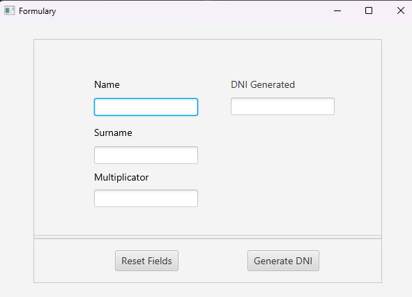
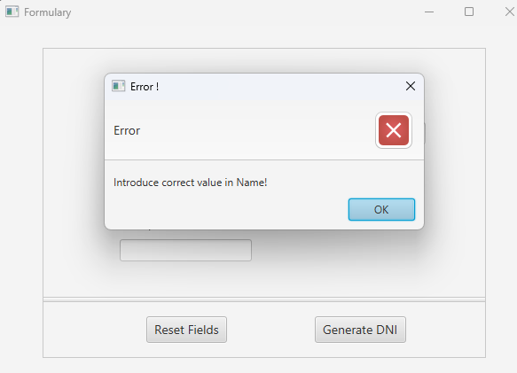

## Password Generator with JavaFX

Esta aplicacion trata de generar un DNI en base a una heuristica, en este proyecto se necesita el nombre, apellido y un numero.

### Casos de error

Se ha creado 2 metodos que son los que gestionan los errores dentro de la clase **UserDataController()** y un metodo el cual muestra el error por pantalla.

- checkInputFieldsNotNull()
  - Comprobamos que nuestro entrada de usuario no contenga solamente espacios y que no sean nulos
  - esta funcion retorna un boolean.

- checkValidFields()
  - En este metodo llamamos a otra funcion que se llama __checkValidString(String)__, la cual recibe un string en este caso los datos que el usauario introduce. 
  - Utilizando checkValidString() comprobamos si los datos introducidos cumplen las normas que hay, por ejemplo que tanto el __nombre__ y el __apellido__ solo contengan minusculas y mayusculas.
  - Este funcion retorna un boolean. 

Interfaz de la aplicacion:

 

Gestion de errores:

 

Gestion de errores cuando el multiplicador esta fuera de rango:

 
