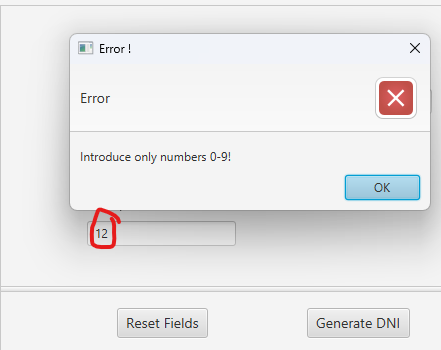

## Password Generator with JavaFX

This application generates a DNI (National Identification Number) based on a heuristic approach. The user must provide a name, surname, and a number.

### Error Handling

Two methods have been implemented to manage errors within the UserDataController class, along with a method to display errors on the screen.

checkInputFieldsNotNull()

Ensures that user input is not empty or composed only of spaces.

Returns a boolean.

**checkValidFields()**

Calls another function, checkValidString(String), which takes a string (the user-provided data) as input.

checkValidString() verifies whether the input meets the required conditions, such as ensuring that both name and surname contain only uppercase and lowercase letters.

Returns a boolean.

Application Interface:

 

Error Handling:

 

Error Handling When the Multiplier Is Out of Range:

 
